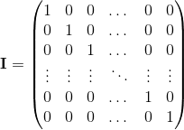

---
# Please do not edit this file directly; it is auto generated.
# Instead, please edit 16-matrixAlg-operations.md in _episodes_rmd/
title: "Matrix Operations"
keypoints:
- '.'
- '.'
- '.'
- '.'
objectives:
- ''
- ''
- ''
- ''
- ''
- ''
- ''
questions:
- What are matrix operations?
- '?'
- '?'
source: Rmd
teaching: 0
exercises: 0
---

## Matrix Operations

In a previous section, we motivated the use of matrix algebra with this system of equations:

We described how this system can be rewritten and solved using matrix algebra:

Having described matrix notation, we will explain the operation we perform with them. For example, above we have matrix multiplication and we also have a symbol representing the inverse of a matrix. The importance of these operations and others will become clear once we present specific examples related to data analysis.

#### Multiplying by a scalar

We start with one of the simplest operations: scalar multiplication. If <i>a</i> is scalar and &Chi; is a matrix, then:

R automatically follows this rule when we multiply a number by a matrix using `*`:

~~~
X <- matrix(1:12,4,3)
print(X)
~~~
{: .language-r}

~~~
     [,1] [,2] [,3]
[1,]    1    5    9
[2,]    2    6   10
[3,]    3    7   11
[4,]    4    8   12
~~~
{: .output}

~~~
a <- 2
print(a*X)
~~~
{: .language-r}

~~~
     [,1] [,2] [,3]
[1,]    2   10   18
[2,]    4   12   20
[3,]    6   14   22
[4,]    8   16   24
~~~
{: .output}

#### The transpose

The transpose is an operation that simply changes columns to rows. We use a &Tau; to denote a transpose. The technical definition is as follows: if &Chi; is as we defined it above, here is the transpose which will be <i>p x N</i>:

In R we simply use `t`:

~~~
X <- matrix(1:12,4,3)
X
~~~
{: .language-r}

~~~
     [,1] [,2] [,3]
[1,]    1    5    9
[2,]    2    6   10
[3,]    3    7   11
[4,]    4    8   12
~~~
{: .output}

~~~
t(X)
~~~
{: .language-r}

~~~
     [,1] [,2] [,3] [,4]
[1,]    1    2    3    4
[2,]    5    6    7    8
[3,]    9   10   11   12
~~~
{: .output}

#### Matrix multiplication

We start by describing the matrix multiplication shown in the original system of equations example:

What we are doing is multiplying the rows of the first matrix by the columns of the second. Since the second matrix only has one column, we perform this multiplication by doing the following:

Here is a simple example. We can check to see if `abc=c(3,2,1)` is a solution:

~~~
X  <- matrix(c(1,3,2,1,-2,1,1,1,-1),3,3)
abc <- c(3,2,1) #use as an example
rbind( sum(X[1,]*abc), sum(X[2,]*abc), sum(X[3,]*abc))
~~~
{: .language-r}

~~~
     [,1]
[1,]    6
[2,]    6
[3,]    7
~~~
{: .output}

We can use the `%*%` to perform the matrix multiplication and make this much more compact:

~~~
X%*%abc
~~~
{: .language-r}

~~~
     [,1]
[1,]    6
[2,]    6
[3,]    7
~~~
{: .output}

We can see that `c(3,2,1)` is not a solution as the answer here is not the required `c(6,2,1)`.

To get the solution, we will need to invert the matrix on the left, a concept we learn about below.

Here is the general definition of matrix multiplication of matrices &Alpha; and &Chi;:

You can only take the product if the number of columns of the first matrix &Alpha; equals the number of rows of the second one &Chi;. Also, the final matrix has the same row numbers as the first &Alpha; and the same column numbers as the second &Chi;. 
After you study the example below, you may want to come back and re-read the sections above.

#### The identity matrix

The identity matrix is analogous to the number 1: if you multiply the identity matrix by another matrix, you get the same matrix. For this to happen, we need it to be like this:

By this definition, the identity always has to have the same number of rows as columns or be what we call a square matrix.

If you follow the matrix multiplication rule above, you notice this works out:

In R you can form an identity matrix this way:

~~~
n <- 5 #pick dimensions
diag(n)
~~~
{: .language-r}

~~~
     [,1] [,2] [,3] [,4] [,5]
[1,]    1    0    0    0    0
[2,]    0    1    0    0    0
[3,]    0    0    1    0    0
[4,]    0    0    0    1    0
[5,]    0    0    0    0    1
~~~
{: .output}

#### The inverse

The inverse of matrix &Chi;, denoted with &Chi;-1, has the property that, when multiplied, gives you the identity &Chi;-1&Chi;= I. Of course, not all matrices have inverses. For example, a <i>2 x 2</i> matrix with 1s in all its entries does not have an inverse. 

As we will see when we get to the section on applications to linear models, being able to compute the inverse of a matrix is quite useful. A very convenient aspect of R is that it includes a predefined function `solve` to do this. Here is how we would use it to solve the linear of equations:

~~~
X <- matrix(c(1,3,2,1,-2,1,1,1,-1),3,3)
y <- matrix(c(6,2,1),3,1)
solve(X)%*%y #equivalent to solve(X,y)
~~~
{: .language-r}

~~~
     [,1]
[1,]    1
[2,]    2
[3,]    3
~~~
{: .output}

Please note that `solve` is a function that should be used with caution as it is not generally numerically stable. We explain this in much more detail in the QR factorization section. 

Exercises1.SupposeXis a matrix in R. Which of the following isnotequivalent toX?•A)t( t(X) )•B)X %*% matrix(1,ncol(X) )•C)X*1•D)X%*%diag(ncol(X))2.Solve the following system of equations using R:3a+ 4b
